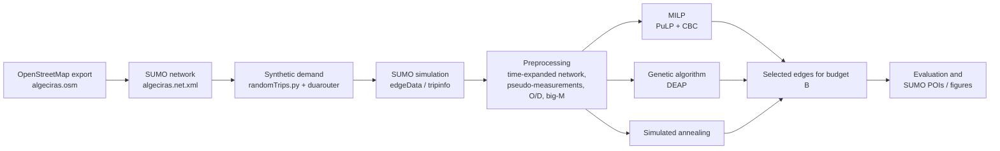
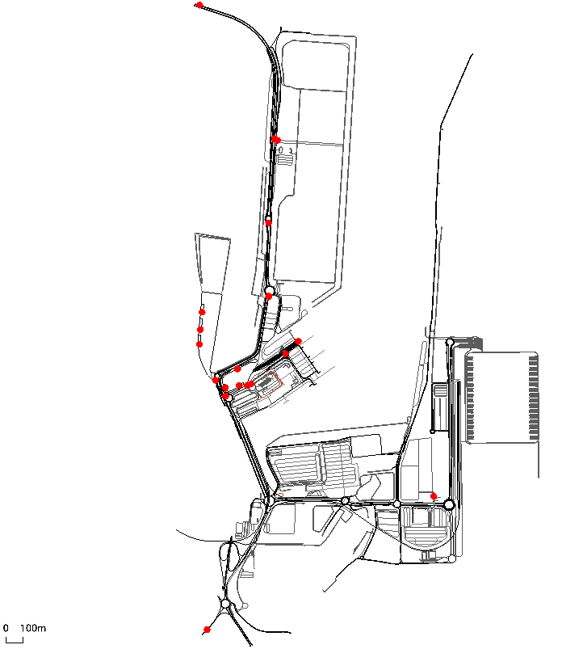

# TSLP Algeciras: traffic sensor placement in the Port of Algeciras

Choosing where to install a limited number of traffic sensors (cameras, loops, counters) in the Port of Algeciras road network, using SUMO microsimulation, a genetic algorithm (DEAP) and a MILP solved with CBC (PuLP).

    

> **Simulation study.** All traffic in this repository is simulated in SUMO with synthetic demand. No real sensor data from the port is used.

**Resumen (ES).** Problema de ubicación de sensores de tráfico (TSLP) en la red viaria del Puerto de Algeciras: dado un presupuesto de *B* sensores, elegir en qué tramos colocarlos para reconstruir los flujos de toda la red con el menor error posible. La red se obtiene de OpenStreetMap y se simula en SUMO con demanda sintética. Se comparan un algoritmo genético (DEAP), un recocido simulado y un MILP resuelto con CBC (PuLP). Es un estudio en simulación.

---

## Problem

Traffic at a port access network is hard to observe: sensors are expensive, and the operator can only afford a handful of them. The question is **which road segments to instrument so that, from the measured segments, the flows on the rest of the network can be reconstructed as accurately as possible**, under a fixed sensor budget *B*. This is a variant of the Traffic Sensor Location Problem (TSLP), applied to the Port of Algeciras, where demand peaks (for example, during the summer Strait crossing operation) make good observability especially useful.

## What we implemented

- Built the port road network from an OpenStreetMap export and edited it in SUMO netedit.
- Generated synthetic demand with SUMO `randomTrips.py` / `duarouter` and ran the simulations to obtain per-edge flows (`edgeData`) and per-vehicle data (`tripinfo`).
- Wrote the preprocessing that turns SUMO output into a time-expanded network with pseudo-measurements, origin/destination flows per interval, critical edges, cycles and cuts.
- Implemented and compared three optimisers under the same budget *B*:
  - a **MILP** (PuLP + CBC),
  - a **genetic algorithm** (DEAP) with a budget-repair operator,
  - a **simulated annealing** baseline.
- Added sensitivity analysis of the GA hyperparameters and tools to export the chosen sensors back into SUMO as POIs.

Third-party components: SUMO (Eclipse SUMO), DEAP, PuLP/CBC, NetworkX and the OpenStreetMap data described under [Licence and attribution](#licence-and-attribution).

## How it works



**Method.**

- **Simulation (SUMO).** The network is simulated for one hour (`begin=0`, `end=3600`) and SUMO aggregates per-edge flows every Δt = 60 s (`DELTA_T` in `src/config.py`).
- **Preprocessing** (`src/preprocessing.py`). Builds the inputs shared by all optimisers: edge flows per scenario and interval, entry/exit nodes, O/D flows, an operational big-M and the critical edges, cycles and cuts (`src/topology_utils.py`).
- **MILP** (`src/milp_model.py`, `src/milp_solve.py`). Binary variable *x<sub>a</sub>* = 1 if edge *a* gets a sensor; continuous reconstructed flows, residuals and node-balance slacks. The objective minimises the weighted residuals on sensed edges plus λ times the flow-balance violations, subject to the **sensor budget** Σ *x<sub>a</sub>* = *B*. Solved with CBC through PuLP.
- **Genetic algorithm** (`src/ga_algorithm.py`, `scripts/run_ga.py`). Binary individuals of length = number of candidate edges; two-point crossover, swap mutation, tournament selection, and a **repair operator that enforces the budget** *B*. Fitness uses a fast surrogate, with an optional exact LP evaluation.
- **Simulated annealing** (`src/sa_algorithm.py`). Baseline with the same budget.
- **Evaluation** (`src/evaluation.py`). Flow coverage per scenario and MILP vs GA comparison plots.

## Results

The repository contains the outputs of the experiments that were run, but **no consolidated results table yet**. What is available:

| Output | Location | Produced by |
|---|---|---|
| Sensor maps per budget and method | `data/Results/*_MILP.png`, `*_GA.png`, `*_SA.png` | `notebooks/01_experimentos.ipynb` |
| GA convergence curves | `data/Results/GA_convergence_B*.png` | `scripts/run_ga.py` |
| MILP vs GA flow-coverage comparison | `data/Results/evaluation/comparison_MILP_vs_GA_B*.png` | `src/evaluation.py` |
| λ sweep for the GA | `data/Results/evaluation/lambda_sweep/` | notebook |
| GA hyperparameter sensitivity | `data/Results/sensitivity/ga_sensitivity_results.csv` and plots | `scripts/ga_sensitivity_analysis.py` |
| Selected edges and SUMO POI files | `data/processed/selected/` | `scripts/run_milp.py`, `scripts/run_ga.py`, `scripts/make_sensor_pois.py` |

Example output, MILP with *B* = 20 (red dots = selected sensors):



## How to run it

**Requirements**

- Python **3.10 or newer** (the code uses `X | Y` type hints; the original environment used Python 3.10 and the notebook was last run on 3.12).
- Python packages in `requirements.txt` (numpy, pandas, scipy, seaborn, PuLP, DEAP, NetworkX, matplotlib, tqdm, Jupyter). Versions are not pinned.
- CBC is bundled with PuLP; no separate solver installation is needed.
- **SUMO 1.25** (the network, routes and detectors in `data/raw/simulation/` were generated with SUMO 1.25.0). Only needed to regenerate the simulation data, not to run the optimisers.

**Installation**

```bash
conda create -n algeciras_milp python=3.10
conda activate algeciras_milp
pip install -r requirements.txt
```

**Minimal run (uses the processed data already in the repo)**

```bash
python -m scripts.run_preprocessing   # rebuilds data/processed/milp_inputs.pkl
python -m scripts.run_milp            # MILP with B = 20, writes data/processed/selected/selected_edges_B20.txt
python -m scripts.run_ga              # GA with B = 20, writes selected_edges_B20_GA.txt and a convergence plot
```

Run the commands from the repository root. The interactive version of the whole workflow (MILP, GA, SA, multi-seed experiments and comparison plots) is in `notebooks/01_experimentos.ipynb`.

<details>
<summary><strong>Regenerating the SUMO data (optional)</strong></summary>

1. Set `SUMO_HOME` to your SUMO installation, for example on Windows:

   ```powershell
   setx SUMO_HOME "C:\Program Files (x86)\Eclipse\Sumo"
   ```

2. Generate synthetic routes:

   ```bash
   python %SUMO_HOME%/tools/randomTrips.py -n data/raw/simulation/algeciras.net.xml \
     -r data/raw/simulation/routes_random.rou.xml -b 0 -e 3600 -p 1.0 --seed 42
   ```

3. Run a scenario (outputs `edgeData`, `tripinfo` and `fcd` into `data/raw/`):

   ```bash
   sumo -c data/raw/simulation/algeciras.sumocfg
   ```

4. Convert the XML output to CSV:

   ```bash
   python src/SUMO/leer_edgedata.py data/raw/edgeData_port_scen1.xml scen1 data/processed/edgeData_scen1.csv
   python src/SUMO/leer_tripinfo.py  data/raw/tripinfo_scen1.xml     scen1 data/processed/tripinfo_scen1.csv
   ```

5. Export selected sensors as SUMO POIs and load them in SUMO-GUI (*Simulation → Edit Configuration → additional-files*):

   ```bash
   python -m scripts.make_sensor_pois data/processed/selected/selected_edges_B20.txt \
     data/raw/simulation/algeciras.net.xml data/processed/selected/sensors_B20.add.xml
   ```

</details>

## Repository layout

```text
data/raw/simulation/   OSM export, SUMO network, routes, detectors and .sumocfg files
data/raw/              SUMO outputs (edgeData, tripinfo, fcd)
data/processed/        CSVs, milp_inputs.pkl, selected edges and POI files
data/Results/          figures and CSVs from the experiments
src/                   preprocessing, MILP, GA, SA, evaluation, SUMO readers
scripts/               command-line entry points
notebooks/             01_experimentos.ipynb (end-to-end experiments)
documentation/         paper draft (PDF)
tests/                 basic GA component checks
```

## Limitations

- **Simulation only.** Flows come from SUMO, not from real port sensors; results describe the model, not measured port traffic.
- **Synthetic demand.** Routes are generated with `randomTrips.py` (random origins and destinations) and `duarouter`; they are not calibrated against real counts or O/D surveys.
- **Single one-hour horizon** per scenario, with 60 s aggregation intervals.
- **Network simplifications** from the OSM export and manual edits in netedit.
- The GA optimises a **surrogate fitness**; the exact LP evaluation is optional and slower.
- Python dependencies are not pinned, so exact numerical results may vary between environments.

## Context

Academic project for the Optimización Computacional Avanzada course in the Máster Universitario en Inteligencia Artificial at Universidad Loyola Andalucía. Developed by Ignacio González Peris and Antonio Quijano. A paper draft describing the method is in `documentation/`.

## Licence and attribution

- **Code:** MIT licence, see [`LICENSE`](LICENSE). The paper in `documentation/` is not automatically covered by this code licence.
- **Map data:** © OpenStreetMap contributors, ODbL 1.0. The file `data/raw/simulation/algeciras.osm` is an OpenStreetMap export, and the SUMO networks derived from it (`algeciras.net.xml`, `algeciras.net-2.xml`) together with the derived routes and detector files remain under the [Open Database License (ODbL) 1.0](https://opendatacommons.org/licenses/odbl/1-0/), not under the MIT licence. See <https://www.openstreetmap.org/copyright>.
